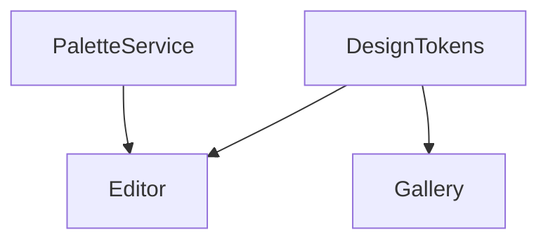

<what-to-do>

When porting an app to another platform, the thing that silently breaks a port is cross-feature dependencies: the shared scaffolding a feature quietly needs, and the order features have to ship in. This skill maps that once, into `PORT-GRAPH.md`, so every per-feature export can *read* its prerequisites instead of someone holding the whole web in their head.

A port graph is not a map of every import. It is only the dependencies that change **what you port first**. If an edge doesn't move that decision, it doesn't belong.

Work in this order:

1. **Read the codebase and the PRDs first.** Derive the map — don't ask what you can read. Identify (a) the *features* — the units that get ported one at a time, matching the PRDs from `screenshot-to-prd` where they exist — and (b) the *shared building blocks* multiple features lean on: design tokens, navigation containers, base/shared components, services and clients, auth, persistence.

2. **Propose the smallest graph that explains the porting order.** Nodes are features and shared blocks. Draw a "needs" edge only when one node genuinely can't be built or tested before another. A component used by exactly one feature is part of that feature, not a shared node — don't promote it. Fewer nodes and edges is better; only what constrains order survives.

3. **Separate what the code shows from what only the user knows.** The code reveals *structural* dependencies — imports, shared types, a common nav host. It cannot reveal *intent* ordering: "port the gallery before the editor because that's my demo path," "do the simplest feature first to establish the Compose patterns." Read the structure; grill the user for the intent.

4. **Grill the edges that matter, one at a time.** For ambiguous or load-bearing edges, ask one question, wait for the answer, and give your recommended answer with it. "The editor imports `PaletteService` and the gallery touches it too — is that one shared block they both need, or two different needs that happen to share a name?" Don't interrogate the obvious edges; confirm the surprising ones — they're the ones that bite during a port.

5. **Find the cycles.** If two features depend on each other, no clean port order exists — surface it the way `grill-with-docs` surfaces a contradiction, and help break it (usually by extracting the shared piece into its own block). A graph with a cycle isn't finished.

6. **Write `PORT-GRAPH.md` lazily,** only once the edges are confirmed. Put the foundation before the features that need it, and group features into port "waves" by dependency depth. Mark anything unresolved in open questions rather than inventing an edge.

</what-to-do>

<supporting-info>

## Principles

### Only edges that change the order belong
The entire value of the graph is deciding what to port first. An edge that doesn't move that decision is noise that makes the graph harder to trust. This is the same instinct as cutting one-off design tokens — keep what constrains, drop what merely exists.

### Sharedness is about reuse, not existence
A block is "shared" only if more than one feature needs it. Used once, it's that feature's own internal detail, not a node in the graph. Frequency decides whether something is foundation.

### Foundation before features
Shared blocks port first. A feature can't be ported faithfully onto scaffolding that isn't there yet — the Android agent will either stub it wrong or block. The recommended sequence always front-loads the foundation.

### Code shows structure, the user supplies intent
Read imports and shared types for the real structural dependencies. Ask the human for the ordering that lives only in their head — the demo path, the feature that should go first to establish patterns. This mirrors the export skill: the code is the truth about what shipped, the human is the truth about what they want first.

### A cycle means the graph isn't done
Circular dependencies have no valid port order. Treat a cycle as a defect to resolve, not a fact to record — almost always by lifting the shared dependency out of both features into its own block.

## Output format

Write `PORT-GRAPH.md`. Keep it lean — it's a reference, not a report.

````markdown
# Port graph — <app name>

> Maps features to the shared blocks they need and the order to port them.
> Read by `feature-to-port-spec` to fill each spec's "port these first" section.

## Shared foundation (port first, in this order)
- <block> — <what it is> — needed by: <features>

## Features
For each feature — `needs` is what must already be ported:
- **<feature>** — needs: <blocks / features> — wave: <n> — note: <intent or gotcha>

## Recommended port sequence
- **Wave 1 (foundation)**: <blocks>
- **Wave 2**: <features with only foundation deps>
- **Wave 3**: <features that depend on Wave 2>

## Diagram


## Open questions
Ambiguous or unconfirmed edges, with the current best guess.

## Source
Codebase: <repo / commit>. PRDs read: <list>.
````

The Mermaid diagram is a *view* of the lists above, for eyeballing — regenerate it whenever the lists change; don't hand-edit it as a separate source.

### How the export skill reads this
`feature-to-port-spec` looks up the feature's node, reads its `needs` list, and emits that as the spec's prerequisites — so the per-feature export never rederives dependencies, it reads them here. The graph is the contract between the two skills; they agree on `PORT-GRAPH.md`.

</supporting-info>
